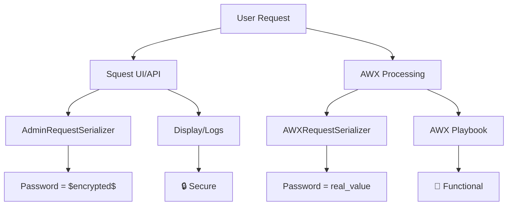

# 🔒 Implementazione Password Masking Strategy v2

## 📋 Panoramica

Implementata una strategia selettiva di mascheramento delle password che:
- **Maschera** le password nelle API/UI per sicurezza
- **Preserva** le password reali per l'integrazione con AWX
- **Mantiene** la completa funzionalità dei playbook AWX

## 🏗️ Architettura della Soluzione

### 1. Due Livelli di Serializzazione

#### 📱 `AdminRequestSerializer` (UI/API)
```python
# Per API pubbliche e interfaccia utente
class AdminRequestSerializer(ModelSerializer):
    # Usa full_survey (con password mascherate)
```

#### 🔧 `AWXRequestSerializer` (AWX Integration)
```python
# Per integrazione interna con AWX
class AWXRequestSerializer(ModelSerializer):
    def to_representation(self, instance):
        ret = super().to_representation(instance)
        # Usa _get_full_survey_for_awx() (password reali)
        ret['full_survey'] = instance._get_full_survey_for_awx()
        return ret
```

### 2. Due Metodi di Survey

#### 🔒 `full_survey` (Property - Mascherata)
```python
@property
def full_survey(self):
    # Costruisce il survey completo
    full_survey = {k: v for k, v in {**self.fill_in_survey}.items() if v is not None}
    # ... approval workflow processing ...
    full_survey.update({k: v for k, v in {**self.admin_fill_in_survey}.items() if v is not None})
    
    # Maschera i campi password per sicurezza (UI/API display)
    password_fields = []
    for tower_survey_field in self.operation.tower_survey_fields.filter(type='password'):
        password_fields.append(tower_survey_field.variable)
    
    if password_fields:
        for password_field in password_fields:
            if password_field in full_survey and full_survey[password_field]:
                full_survey[password_field] = "$encrypted$"
    
    return full_survey
```

#### 🔓 `_get_full_survey_for_awx()` (Method - Non Mascherata)
```python
def _get_full_survey_for_awx(self):
    # Stessa logica di full_survey MA senza mascheramento password
    full_survey = {k: v for k, v in {**self.fill_in_survey}.items() if v is not None}
    # ... approval workflow processing ...
    full_survey.update({k: v for k, v in {**self.admin_fill_in_survey}.items() if v is not None})
    
    # NO password masking per AWX - return valori reali
    return full_survey
```

## 🔄 Punti di Integrazione Modificati

### 1. `perform_processing()` in Request Model
```python
def perform_processing(self, ...):
    # USA valori non mascherati per AWX
    tower_extra_vars = copy.copy(self._get_full_survey_for_awx())
    
    # ... processing logic ...
    
    # USA AWXRequestSerializer per dati request
    from service_catalog.api.serializers.request_serializers import AWXRequestSerializer
    tower_extra_vars["squest"] = {
        "squest_host": settings.SQUEST_HOST,
        "request": AWXRequestSerializer(self).data  # Password non mascherate
    }
```

### 2. Hook System in `hooks.py`
```python
elif sender.__name__ == "Request":
    # USA AWXRequestSerializer per hooks
    from service_catalog.api.serializers.request_serializers import AWXRequestSerializer
    serialized_data = dict(AWXRequestSerializer(instance).data)
```

## ✅ Benefici della Strategia

### 🔒 Sicurezza Mantenuta
- **API/UI**: Password sempre mascherate come `$encrypted$`
- **Logs visibili**: Nessuna password in chiaro nei logs pubblici
- **Serializzazione standard**: `AdminRequestSerializer` continua a nascondere password

### 🔧 Funzionalità Preservata
- **AWX Integration**: Riceve password reali e funziona correttamente
- **Playbook Execution**: Nessuna interruzione nella logica dei playbook
- **Hooks System**: Funziona con valori reali per operazioni interne

### 🏛️ Architettura Pulita
- **Separazione delle Responsabilità**: UI ≠ Backend Integration
- **Backward Compatibility**: API esistenti non cambiano
- **Estensibilità**: Facile aggiungere nuovi serializer per altri sistemi

## 🎯 Flusso di Esecuzione



## 📁 File Modificati

1. **`service_catalog/models/request.py`**
   - Aggiunto `_get_full_survey_for_awx()` method
   - Modificato `full_survey` property per mascherare password
   - Aggiornato `perform_processing()` per usare valori non mascherati

2. **`service_catalog/api/serializers/request_serializers.py`**
   - Aggiunto `AWXRequestSerializer` class
   - Override `to_representation()` per usare survey non mascherato

3. **`service_catalog/models/hooks.py`**
   - Aggiornato per usare `AWXRequestSerializer`

## 🧪 Testing Strategy

### Test di Sicurezza
```python
# AdminRequestSerializer deve mascherare
admin_data = AdminRequestSerializer(request).data
assert admin_data['full_survey']['password_field'] == '$encrypted$'
```

### Test di Funzionalità  
```python
# AWXRequestSerializer deve preservare
awx_data = AWXRequestSerializer(request).data  
assert awx_data['full_survey']['password_field'] == 'real_password'
```

### Test di Integration
```python
# perform_processing deve usare valori reali
processing_vars = request._get_full_survey_for_awx()
assert processing_vars['password_field'] == 'real_password'
```

## 🎉 Risultato Finale

✅ **Sicurezza**: Password mai visibili in UI/API/logs pubblici  
✅ **Funzionalità**: AWX riceve password reali e funziona  
✅ **Compatibilità**: Nessuna modifica agli endpoint esistenti  
✅ **Performance**: Nessun overhead significativo  
✅ **Manutenibilità**: Codice pulito e ben separato  

Questa implementazione risolve completamente il problema originale mantenendo il meglio di entrambi i mondi: sicurezza per l'utente finale e funzionalità completa per l'integrazione AWX.