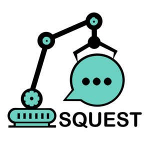

    

<h3 align="center">Self service portal on top of Red Hat Ansible Automation Platform</h3>

Squest is a sophisticated framework that empowers you to create a web portal offering a comprehensive **Everything-as-a-Service** experience.

In Squest, the services made available are not hardcoded. Instead, each service serves as a reference to your automation capabilities within the backend engine, 
Red Hat Ansible Automation Platform (RHAAP)/AWX (formerly known as Ansible Tower). This essentially means that anything, as long as it exists as an automation script, 
can be transformed into a service. Your only limitation lies in your own proficiency in automation.

Going beyond mere deployment, Squest maintains a record of every instance of services it provisions in its database. 
This allows you to augment these instances with additional automation, enabling your users to effectively manage the lifecycle of their resources. 
Each operation performed corresponds to yet another link to an automation process in the backend. This empowering feature enhances user autonomy, 
relieving you of the burden of providing extensive support and managing object updates.

If you want an idea of what you can do with Squest, click on the image below.

## Features

- Service catalog:
  - Add services to your catalog based on job templates you have in your Red Hat Ansible Automation Platform/AWX instance
  - Manage requests for services (review, update, approve and process)
  - Manage lifecycle of each instance of a service
  - Integrated or external support page
  - Organization, team and user management
  - Approval workflows
  - Custom on-boarding documentation
  - RBAC (Roles, Permissions, Role bindings)

- Resource tracking:
  - Create generic objects
  - Link objects to compose layers of your infrastructure (Physical servers, Virtualization, Containers, Projects, Tenants,...)
  - Visualize pool of resource of what you have provided (CPU, vCPU, memory, disk...)
  - Check consumptions before approving new requests
  - Graph representation of resource layers
  - Set quotas on each attribute
  
## Links

:blue_book: [Documentation](https://hewlettpackard.github.io/squest/latest) 
:speech_balloon: [Chat on Gitter](https://app.gitter.im/#/room/#HewlettPackard_squest:gitter.im) 
:movie_camera: [Demo video](https://youtu.be/mQnNkSMMXwg) 
:monkey_face: [Our Ansible playbook testing framework](https://github.com/HewlettPackard/monkeyble)

> If you like the project, star it ⭐, it motivates us a lot 🙂
