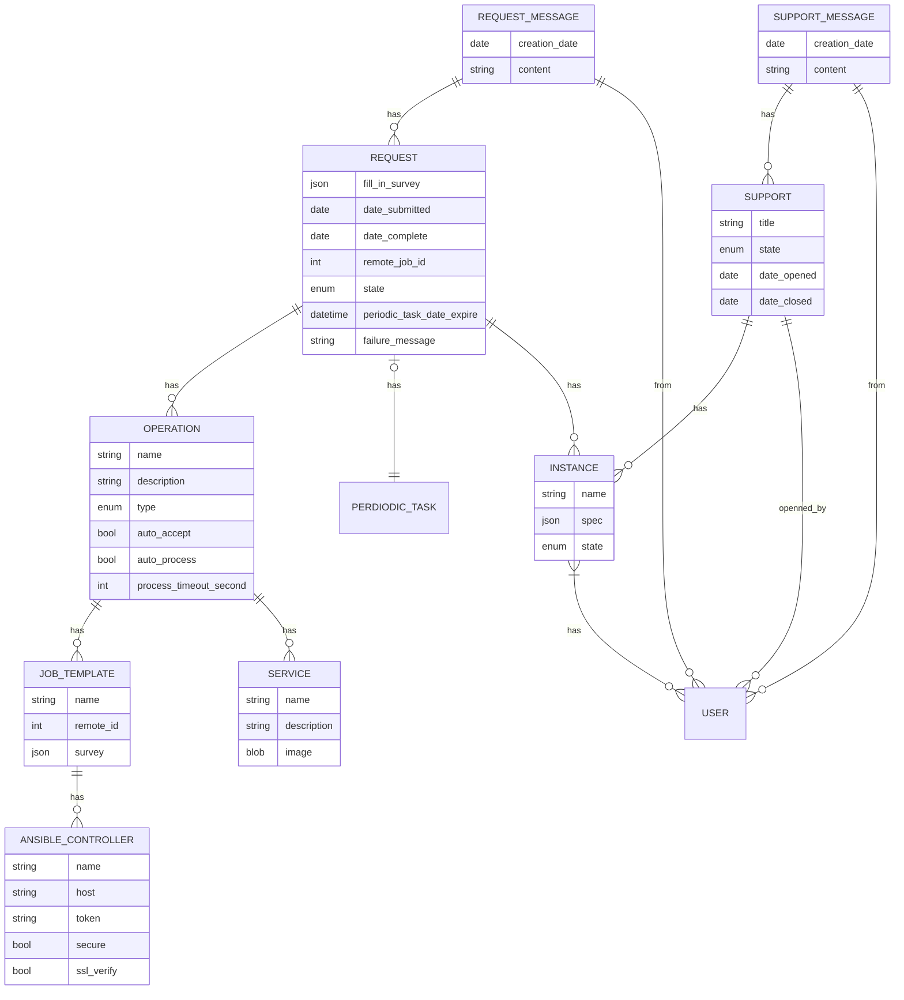

# Database Entity Relationship Diagrams

```mermaid
erDiagram
    ANSIBLE_CONTROLLER {
        string name
        string host
        string token
        bool secure
        bool ssl_verify
    }
    
    JOB_TEMPLATE {
        string name
        int remote_id
        json survey
    }
    
    OPERATION {
        string name
        string description
        enum type
        bool auto_accept
        bool auto_process
        int process_timeout_second
    }
    
    SERVICE {
        string name
        string description
        blob image
    }
    
    REQUEST {
        json fill_in_survey
        date date_submitted
        date date_complete
        int remote_job_id
        enum state
        datetime periodic_task_date_expire
        string failure_message
    }
    
    INSTANCE {
        string name
        json spec
        enum state
    }
    
    SUPPORT {
        string title
        enum state
        date date_opened
        date date_closed
    }
    
    REQUEST_MESSAGE {
        date creation_date
        string content
    }
    
    SUPPORT_MESSAGE {
        date creation_date
        string content
    }
    
    JOB_TEMPLATE ||--o{ ANSIBLE_CONTROLLER: has
    OPERATION ||--o{ JOB_TEMPLATE: has
    OPERATION ||--o{ SERVICE: has
    REQUEST ||--o{ OPERATION: has
    REQUEST |o--|| PERDIODIC_TASK: has
    REQUEST ||--o{ INSTANCE: has
    INSTANCE }|--o{ USER: has
    SUPPORT ||--o{ INSTANCE: has
    SUPPORT ||--o{ USER: openned_by
    REQUEST_MESSAGE ||--o{ REQUEST: has
    REQUEST_MESSAGE ||--o{ USER: from
    SUPPORT_MESSAGE ||--o{ SUPPORT: has
    SUPPORT_MESSAGE ||--o{ USER: from
```
