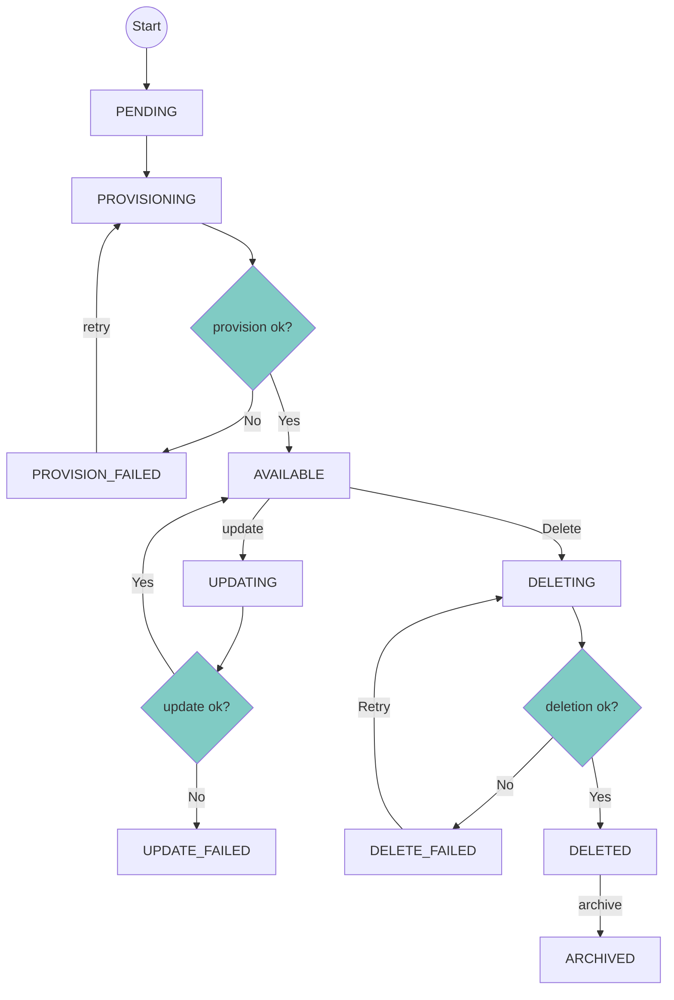

# Instance state machine

```mermaid
graph TB
    start((Start))
    start --> pending
    pending[PENDING]
    provisioning[PROVISIONING]
    provision_failed[PROVISION_FAILED]
    available[AVAILABLE]
    updating[UPDATING]
    update_failed[UPDATE_FAILED]
    deleting[DELETING]
    delete_failed[DELETE_FAILED]
    deleted[DELETED]
    archived[ARCHIVED]
    pending --> provisioning
    provision_ok{provision ok?}
    style provision_ok fill:#80CBC4
    provisioning --> provision_ok
    provision_ok --> |No| provision_failed
    provision_ok --> |Yes| available
    provision_failed --> |retry| provisioning
    available --> |update| updating
    update_ok{update ok?}
    style update_ok fill:#80CBC4
    updating --> update_ok
    update_ok --> |No| update_failed
    update_ok --> |Yes| available
    available --> |Delete| deleting
    deletion_ok{deletion ok?}
    style deletion_ok fill:#80CBC4
    deleting --> deletion_ok
    deletion_ok --> |No| delete_failed
    deletion_ok --> |Yes| deleted
    deleted --> |archive| archived
    delete_failed --> |Retry| deleting
```
