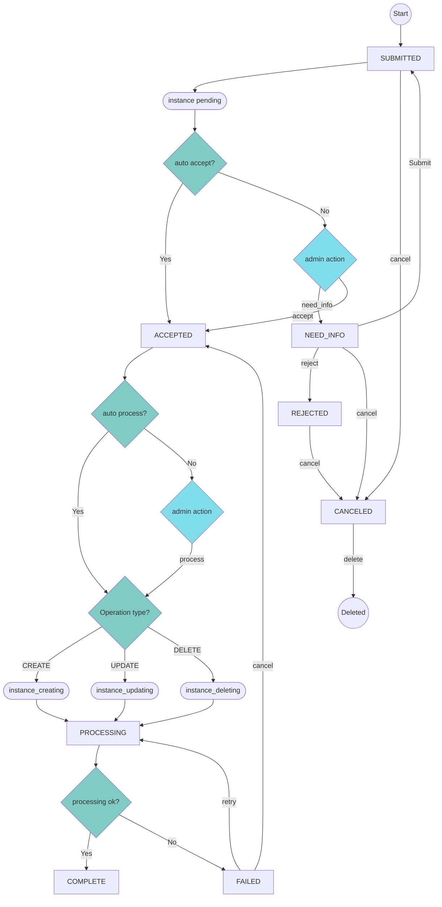

# Request state machine

```mermaid
graph TB
   
    start((Start))
    submitted[SUBMITTED]
    start --> submitted
    auto_accept{auto accept?}
    style auto_accept fill:#80CBC4
    instance_pending([instance pending])
    submitted --> instance_pending
    instance_pending --> auto_accept
    accepted[ACCEPTED]
    auto_accept -->|Yes| accepted
    admin_action_1{admin action}
    style admin_action_1 fill:#80DEEA
    auto_accept -->|No| admin_action_1
    need_info[NEED_INFO]
    admin_action_1 -->|need_info| need_info
    admin_action_1 -->|accept| accepted
    rejected[REJECTED]
    need_info -->|reject| rejected
    need_info -->|Submit| submitted
    canceled[CANCELED]
    need_info --> |cancel|canceled
    rejected --> |cancel|canceled
    submitted --> |cancel|canceled
    canceled --> |delete| deleted
    deleted((Deleted))
    auto_pocess{auto process?}
    style auto_pocess fill:#80CBC4
    accepted --> auto_pocess
    auto_pocess --> |Yes| operation_type
    admin_action_2{admin action}
    auto_pocess --> |No| admin_action_2
    admin_action_2 --> |process| operation_type
    style admin_action_2 fill:#80DEEA
    operation_type{Operation type?}
    style operation_type fill:#80CBC4
    instance_creating([instance_creating])
    instance_updating([instance_updating])
    instance_deleting([instance_deleting])
    operation_type --> |CREATE| instance_creating
    operation_type --> |UPDATE| instance_updating
    operation_type --> |DELETE| instance_deleting
    processing[PROCESSING]   
    instance_creating --> processing
    instance_updating --> processing
    instance_deleting --> processing
    processing_ok{processing ok?}
    style processing_ok fill:#80CBC4
    processing --> processing_ok
    complete[COMPLETE] 
    failed[FAILED] 
    processing_ok --> |Yes| complete
    processing_ok --> |No| failed
    failed --> |retry| processing
    failed --> |cancel| accepted
```