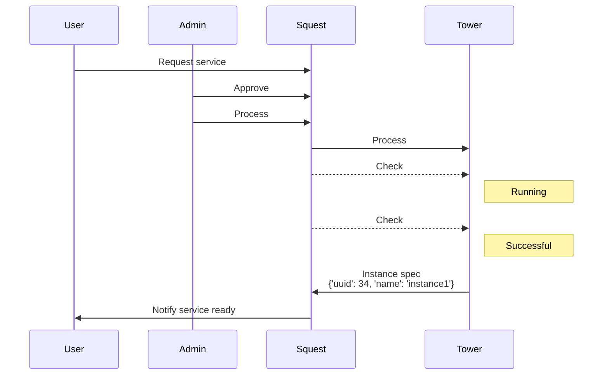
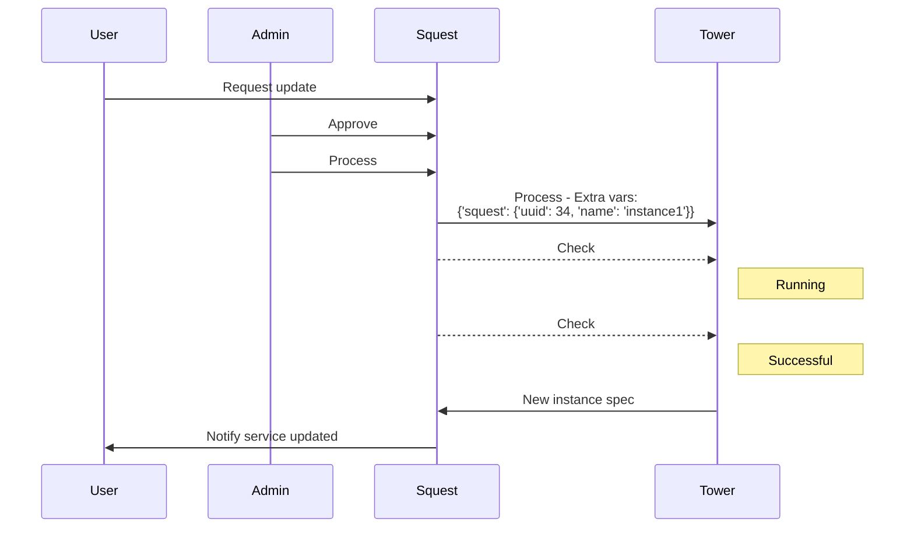

# Squest

Squest is a Web portal that allow to expose Ansible Tower based automation as a service.

Features:

- Catalog of service that point to an Ansible Tower/AWX job template
- Admin approval on requests
- Instance lifecycle management (update, delete)

If you want an idea of what you can do with Squest, click on the image below

## Create a new instance workflow

Here is the workflow when a user ask for a new instance of a service.
At the end of the creation, Tower uses the API to send information(spec) about the created instance.

Specs related to the created instance are important in order to be sent later to a playbook in charge of updating 
this particular instance.
Sent specs must contain unique IDs that allow to strongly identify the instance (E.g: `uuid` of a VMware VM)

## Update an existing instance workflow

Here is the workflow when updating a service.

Squest will automatically attach an `extra_vars` named `squest` that contains the instance spec sent by the playbook used to create the instance.
The playbook used to update the instance need to use info placed in `squest` in order to retrieve the instance that need to be updated.

The update playbook can send a new version of the instance to squest at the end of its process.

