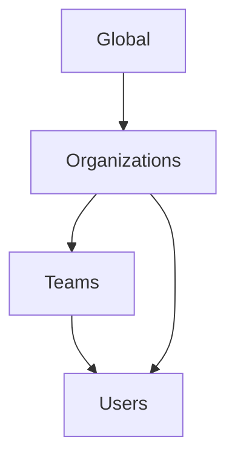
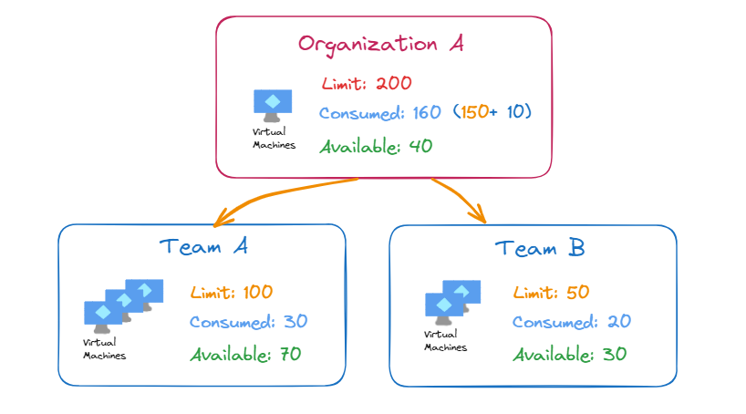

# Access

Squest accesses are managed by following levels:

## Global scopes

Global scopes are permissions that are set to a particular user on the "Global" level.
A permission set as this level is granted across all organizations and teams.

## Organizations and Teams

Organization is a scope that may contain Teams and Users.
Teams are group of user that belong to an Organization.

!!! note

    A user need to be present into an organization in order to be added to a team 

### Default roles

When creating an organization or a team, default roles can be assigned. Those roles are automatically granted to each user added then to the Organization/Team.
For example, setting "Instance Viewer" as default role will allow every member of the Organization to see all created instance from the service catalog.

### RBAC

RBAC (Role Based Access Control) allows to set some roles to users of an organization or a team.

### Quota

When an attribute is defined in the resource tracker it becomes automatically available as a **quota** in organizations or teams.

When a request is made with a **survey field** attached to a **quota**, then the value is limited to the current quota available.
Once the request is accepted, the created resource is linked to the service catalog instance and the available quota limit is updated.

!!! warning

    The quota depend on created resources in the resource tracking. In order to use a quota, each instance of the service catalog need to be linked to a resource of the resource tracking. Example [here](resource_tracking/resource.md#link-a-service-catalog-instance).

- Quota can be set at organization or team level.
- Each organization can dispatch the given quota to their teams
- Quotas can be reorganized at anytime across the teams as long as no instance are using them

