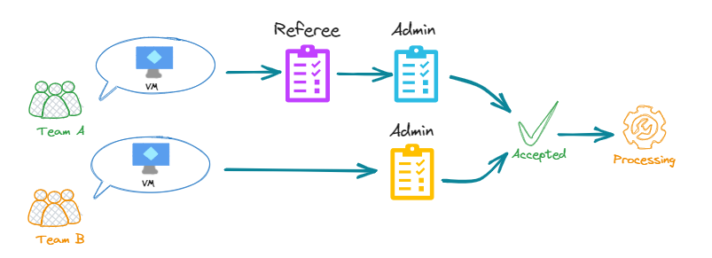
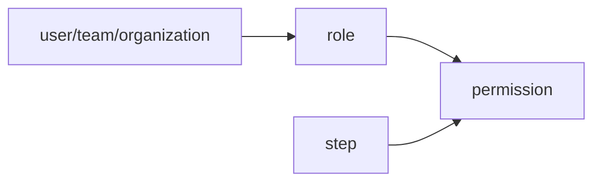

# Approval workflows

By default, _Requests_ can be approved by any user which has the `accept_request` permission. 

Approval workflows are a way to **split the request 
accepting process** in multiple step that can be reviewed by any user with a **custom permission**.

Approval workflow can be scoped to some organization or team so a same operation can be requested differently following who is asking it.

Each step may have a part of the required operation's survey. 



## Workflows

An _Approval Workflow_ is composed by one or multiple [_Approval Step_](#approval-step).
_Approval Steps_ of the Workflow must be approved one by one following the order. After accepting the last one, the
request switch to _ACCEPTED_ state and can be processed.

!!! note

    The auto-accept option can not be set in the _Operation_ with an Approval Workflow. 
    This need to be configured into the step [auto accept condition](#auto-accept)

Configuration:

| Name              | Description                                                                  |
|-------------------|------------------------------------------------------------------------------|
| Name              | Unique identifier of the _Approval Workflow_                                 |
| Operation         | Service operation that will use the workflow                                 |
| Restricted scopes | List of organization or team which are going to be concerned by the workflow |

## Steps

Steps are the breakpoint of a Squest request. Each step need to be accepted in order to validate the request.

Configuration:

| Name            | Description                                                                                                 |
|-----------------|-------------------------------------------------------------------------------------------------------------|
| Name            | Unique identifier of the _Step_                                                                             |
| Permission      | Permission required to be allowed to accept or reject the request. By default set to `approve_approvalstep` |
| Readable field  | Field from the survey that will be shown in the form but cannot be updated in the step                      |
| Editable  field | Field from the survey that can be filled or updated from a previous step                                    |

!!! warning

    If the _job template_ behind the _operation_ has some **mandatory** fields in its survey then those fields need to be configured in at least in one step.

By default, Squest comes with a single [permission](rbac.md) named `approve_approvalstep` that can be used in steps. 

Custom permissions can be created and added to a role to avoid using the default one. 



### Auto accept

A step can be auto accepted on a condition placed in the "Auto accept condition" of the step configuration.

The condition is a Jinja string which is evaluated like an Ansible when condition. The available context is the _request_.

For example, to validate the step following the name of the instance:
```
request.instance.name == 'this_is_a_very_good_name'
```

Or testing a survey field
```
request.fill_in_survey['vCPU'] < 8
```

Full `request` object definition can be retrieved through the [API documentation](../../administration/api.md).

More example of jinja templating are available in the [dedicated documentation section](../advanced/jinja.md).

!!! warning

    The auto accept process will not complete or update the survey. 
    If a mandatory field is missing at the end of the approval, the executed job template may fail due to missing variable.
