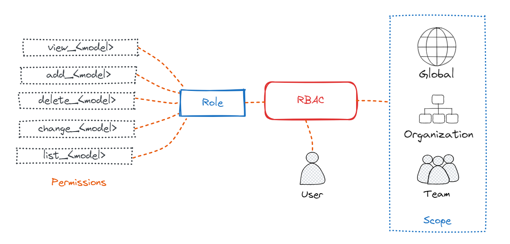
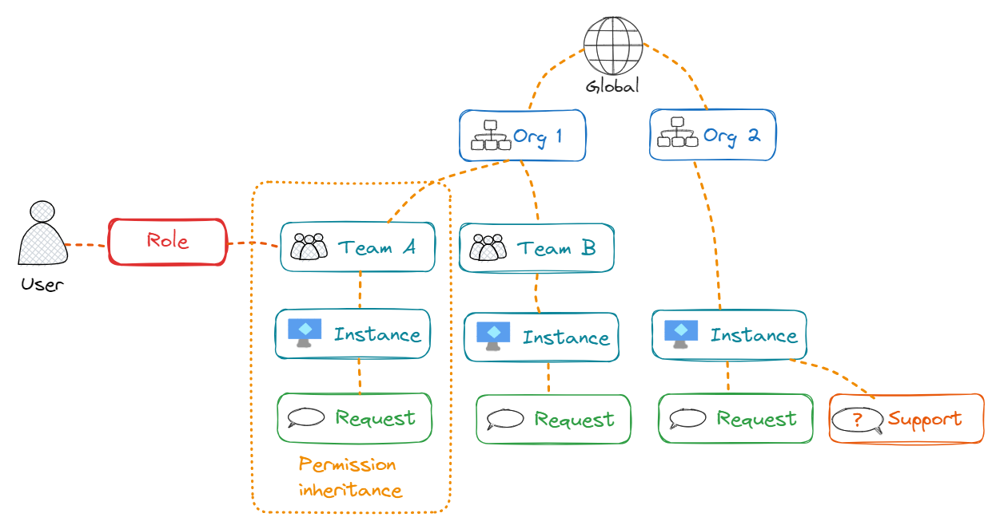

# RBAC (Role Based Access Control)

Role-based access control (RBAC), is a mechanism that restricts Squest access.
It involves setting **permissions** to enable access to authorized users. Permissions are then grouped
into **Roles** and given to a scope which can be a _team_ or and _organizations_ or _global_. **RBAC** is the link between a role, a scope and a user.

The Squest RBAC system enable an administrator to grant users or groups the ability to perform an action
on arbitrary subsets of objects in Squest.

## Permissions

Permission in Squest represent a relationship with following components:

- **Name:** A short description  of the permission.
- **Codename:** A unique identifier for the permission with camel case format.
- **Content type:** A Squest object (E.g: Request, Instance)

For example, a permission named "Can request a day2 operation on instance" attached to the content type "instance".
This permission is required, like the name is suggesting, to create a request for a day 2 operation on an existing instance.

All objects have **generic** CRUD (Create, Retrieve/List, Update, Delete) permissions by default:

- `create_object` to create the object
- `view_object` to retrieve the object
- `list_object` to list object instances
- `change_object` to update the object
- `delete_object` to delete the object

!!!note

    Full permission list is available in the **RBAC** section of your Squest instance.

**Specific** Squest permissions:

| Short description                               | Codename                      | Object           |
|-------------------------------------------------|-------------------------------|------------------|
| Can add users in global permission              | add_users_globalpermission    | globalpermission |
| Can delete users in global permission           | delete_users_globalpermission | globalpermission |
| Can view users in global permission             | view_users_globalpermission   | globalpermission |
| Can add users in organization                   | add_users_organization        | organization     |
| Can delete users in organization                | delete_users_organization     | organization     |
| Can view users in organization                  | view_users_organization       | organization     |
| Can consume quota of the scope                  | consume_quota_scope           | scope            |
| Can add users in team                           | add_users_team                | team             |
| Can delete users in team                        | delete_users_team             | team             |
| Can view users in team                          | view_users_team               | team             |
| Can approve/reject an approval step             | approve_reject_approvalstep   | approvalstep     |
| Can view admin custom link                      | view_admin_customlink         | customlink       |
| Can request an admin day2 operation on instance | admin_request_on_instance     | instance         |
| Can archive instance                            | archive_instance              | instance         |
| Can change admin spec on instance               | change_admin_spec_instance    | instance         |
| Can request a day2 operation on instance        | request_on_instance           | instance         |
| Can unarchive instance                          | unarchive_instance            | instance         |
| Can view admin spec on instance                 | view_admin_spec_instance      | instance         |
| Can accept request                              | accept_request                | request          |
| Can archive request                             | archive_request               | request          |
| Can cancel request                              | cancel_request                | request          |
| Can ask info request                            | need_info_request             | request          |
| Can process request                             | process_request               | request          |
| Can reject request                              | reject_request                | request          |
| Can re-submit request                           | re_submit_request             | request          |
| Can unarchive request                           | unarchive_request             | request          |
| Can request an admin operation on service       | admin_request_on_service      | service          |
| Can request operation on service                | request_on_service            | service          |
| Can close support                               | close_support                 | support          |
| Can reopen support                              | reopen_support                | support          |
| Can sync RHAAP/AWX                              | sync_towerserver              | towerserver      |

!!!note

    New permissions can be created in the context of [approval steps](approval_workflow.md#steps). 

## Default permissions

Default permissions are permissions granted to all logged Squest user. Permissions are purely additive (there are no "deny" rules).

!!!warning

    Changing the list of default permissions may impact the global bahavior of Squest. Use with caution.

## Roles

A role is a set of permissions.
After creating a _Role_, you can assign it to a _user_ though a _team_, an _organization_ or _globally_.

Giving a role to a scope gives permissions to all underlying objects of the scope.

