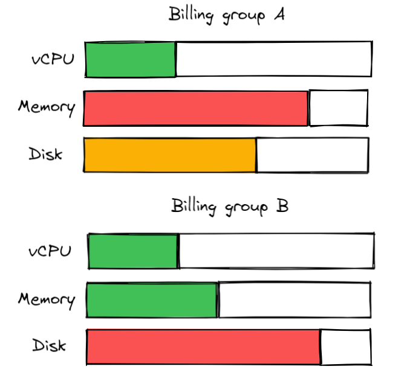
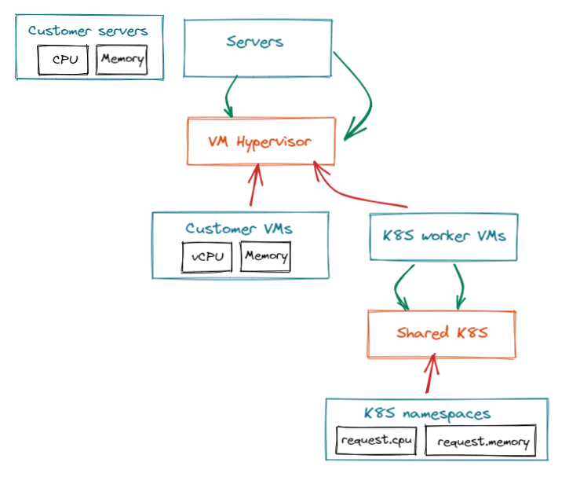
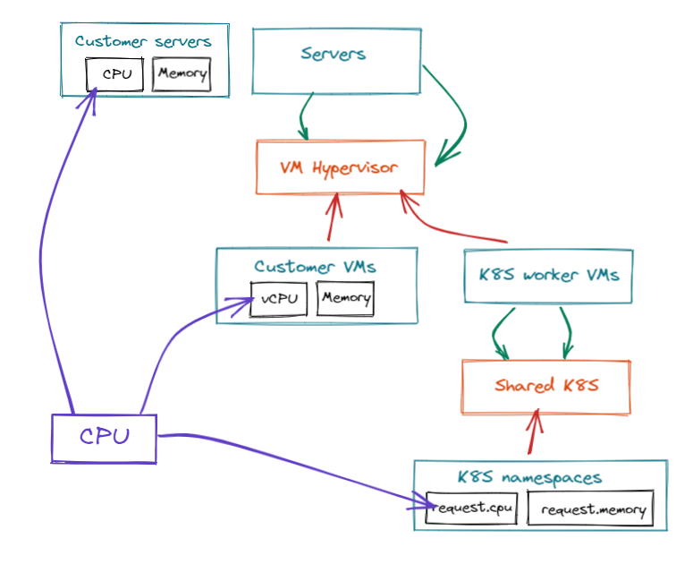
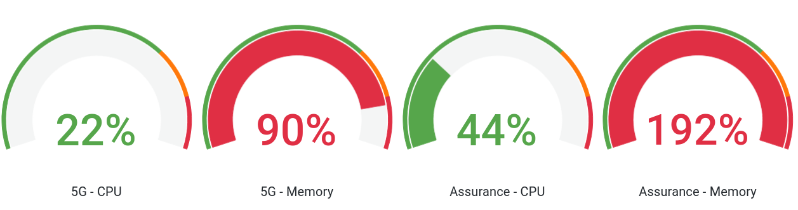

# Billing groups

Billing groups are linked to users and allow Squest administrator to visualize who is consuming what.

!!! note

      Billing groups is an optional feature.

## Create billing groups

As an administrator you can create multiple billing group and place user in them.
A user can belong to multiple billing group.

## Configure billing group in the service catalog

By default, Squest services are not linked to any billing group.

Administrators can configure how the billing of the service will be predefined.

Through the service form, choices are:

- [Administrator defined billing group](#administrator-defined-billing-group)
- User defined billing group:
      - [From his billing group](#from-his-billing-group)
      - [From all billing group](#from-his-billing-group)

### Administrator defined billing group

Administrators select a fixed billing group (can be none). 
Each created instance will be linked to this billing group.

Administrators can also hide the billing from the end users. 
The billing group will not be asked neither shown in the end user form when requesting the service.

### User defined billing group

#### From his billing group

Administrators let the end user choose from his billing group when he sends an instance request.

!!! note

      Users without billing groups can not request this service.

#### From all billing group

Administrators let the end user choose from all available billing group when he requests a service.

## Quota

Quota can be used to:

- Track consumption of resources per billing group
- Create an auto approval request process by using them through [global hooks](../settings/#global-hooks) and the [squest API](api.md)

### Quota and attributes

A quota is a group of resource group attributes that you consider being of the same type.

Let's take an example. We do provide 3 services through the catalog: 

- Bare metal server
- Virtual machines in a VMware hypervisor
- K8S namespaces in a shared K8S cluster

Each service create a resources in 3 different resource group of the resource tracking.

The simplified graph view of resource group would be the following:

!!! note

      All attributes are not represented. For a complete example of resource group and resource pool attribute link refer to the [resource tracking doc](resource_tracking.md)

No matter what service will be provisioned from the service catalog, we want to track for example our global consumption of CPU.
The global CPU is actually linkable to:

- the `CPU` attribute of the "Customer servers" resource group
- the `vCPU` attribute of the "Customer VMs" resource group
- the `request.cpu` attribute of the "K8S namespaces" resource group

So we would create a quota named "CPU" and link it to all resource group attribute definition

### Link quota to billing groups

Once quota are defined, you can link them to each billing group and set a **limit**.
Squest will then calculate the consumption by retrieving each instance that are linked to tracked resource attributes.

!!! note

      The limit does not block any request from the service catalog. This field is used to give the administrator information about consumptions.
      The total consumption can exceed limit if the administrator provision services anyway.

Consumed quota and limits are exposed as [Prometheus metrics](../metrics/#squest_quota_consumed). 
You can then create your own Grafana dashboard from them to visualize percentage consumption of each attribute per billing group.

