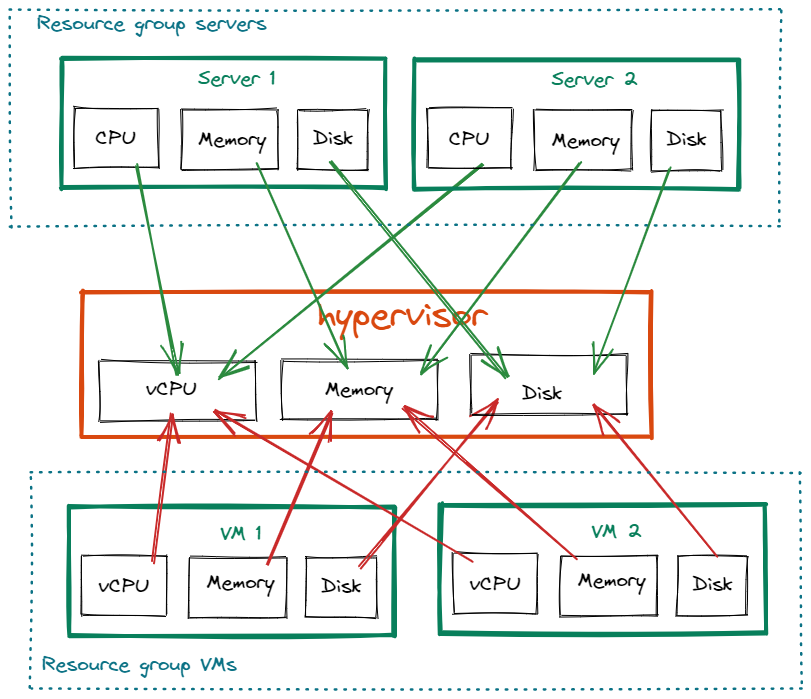
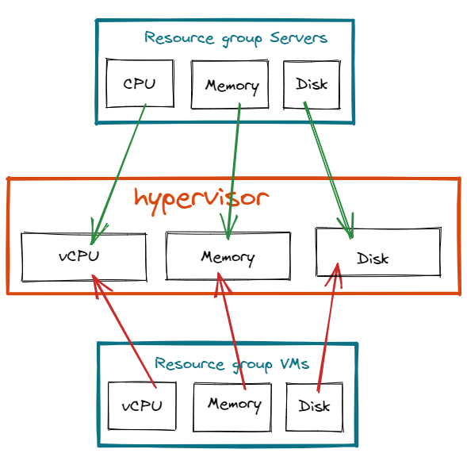
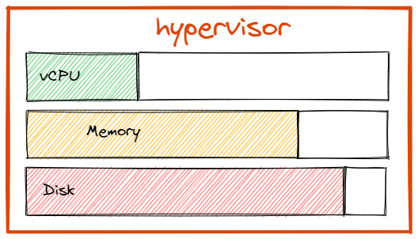
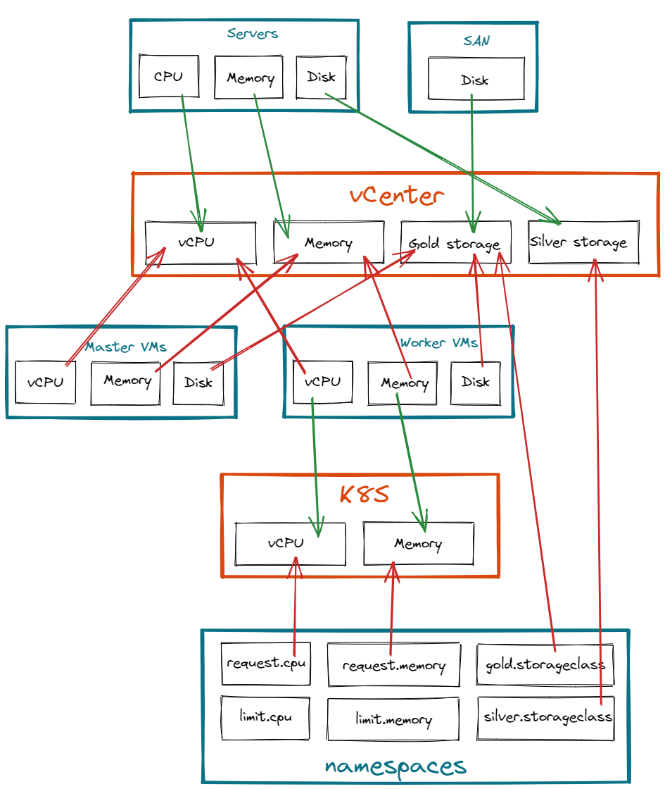

# Resource tracking

Nowadays, IT infrastructures are composed of multiple layers. Physical servers, virtual machines, containers, storage,...
Each layer is consumer or a producer of resources of another layer.
As an IT administrator, we need to monitor resource consumption of a top layers to be sure that we can provide 
services on underlying layers. 

The resource tracking feature allows to monitor reserved resources and highlight available resource in an infrastructure.

## Concept

To introduce the concept of resources, lets take the example of a virtualization stack like a VMware vCenter.

The stack is composed of physical servers that **produce** resources like `CPU` and `memory` to the hypervisor.
Then we can create VMs that will **consume** those resources as virtual CPU(`vCPU`) and `memory`.
The hypervisor is then a **resource pool** with **producers** and **consumers** of resources.

If we want to add more VMs that **consume** resources from the hypervisor resource pool, we need to be sure we have enough physical 
servers that **produce** into it.  

This stack could be drawn like the following with `resource group`(blue), `resource pool`(orange) and `resources`(green):



In this example, we have:

- two **resources** of the same kind(server) that **produce** resources into the **resource pool** `hypervisor`
- two **resources** of the same kind(VM) that **consume** resources from the **resource pool** `hypervisor`

As server **resources** are of the same kind and **produce** in the same pool on the same **attributes**, they belong to the same **resource group** `servers`.

As VM **resources** are of the same kind and **consume** in the same pool on the same **attributes**, they belong to the same **resource group** `VMs`.

The previous drawing could be then simplified by just showing **resource groups** and **resource pool**:



## Generic objects

### Resource pool

A `resource pool` is a generic object composed by `attributes`.
Resource pool attributes have **producers** and **consumers** which are attributes from `resource groups`.

The sum of all `resource group attributes` that **produce** in the same `resource pool attribute` give a **total produced**.

The sum of all `resource group attributes` that **consume** in the same `resource pool attribute` give a **total consumed**.

The difference between **total produced** and **total consumed** gives the amount of **available resources** for a particular `resource pool attribute`.



### Resource group

A `resource group` is a definition of a resource of same kind, composed of attributes that may **produce** or 
**consume** from a particular `resource pool`.

Example of resource group:

- Bare metal servers
- Physical disks
- VMware VMs
- K8S namespaces
- Openshift projects
- Openstack tenants

### Resource

A resource is an instance of a `resource group` definition.
Resources can be created, updated or deleted from the Squest UI or API.
Updating resources in a resource group impact the total amount of produced or consumed resource on pool's attributes.

## Multiple layer example

In this example we do track the consumption of an orchestrator of container like Kubernetes or Openshift. 
Namespaces (or projects in Openshift world) are a way to divide cluster resources between multiple users by using 
resource quota.

Openshift and Kubernetes frameworks are commonly deployed in a virtual machines. 
So we retrieve layers from previous example with bare metal servers that produce resources in an hypervisor.

Orchestrators are usually composed of 2 kind of node: Masters and Workers.
Master VMs are used by the infrastructure itself and workers for user's workloads, aka namespaces.

As namespaces are only executed in "worker" nodes, we need to declare 2 different **resource group**: 

- Master VMs 
- Worker VMs 

The aggregation of resources of all workers compose the **resource pool** of available resources that the `namespaces` 
**resource group** will consume.

The complete resource tracking definition would look like the following:



With this definition, we are able to determine there is enough available resources in pools to handle underlying objects.

Adding a new namespace in the last **resource group** `namespaces` will generate more consumption on the `K8S` 
**resource pool**. If this last pool is lacking of resources, adding more worker node in the `worker VMs` **resource 
group** will be required, generating consumption on upper layers and so on...

## Link service catalog instances to resources

Resources can be created from the API. It allows to create automatically a new resource in a resource group when 
something is provisioned from the service catalog.

In the example below, the playbook executed in Tower/AWX would have created a VM. 
At the end of the process we call the squest API to instantiate a resource in the right resource group to reflect the 
consumption.
We link as well the pending instance(given by `squest.instance.id`) to this resource via the flag `service_catalog_instance`.
```yaml
- name: Add resource in resource group example
  hosts: localhost
  connection: local
  gather_facts: false

  vars:
    squest_api: "http://127.0.0.1:8000/api/"
    resource_group_vm_id: 8
    squest: # this would be the sent data from squest as extra vars
      instance:
        id: 8
        name: test
        service: 1
        spec: { }
        state: PROVISIONING
    vm_name: "test-vm"
    vm_vcpu: 4
    vm_memory: 16

  tasks:
    - name: Print info sent by Squest
      debug:
        var: squest

    # -----------------------
    # PLACE HERE ALL THE MAGIC TO CREATE THE RESOURCE
    # -----------------------
    - name: Create a resource in squest
      uri:
        url: "{{ squest_api }}resource_tracker/resource_group/{{ resource_group_vm_id }}/resources/"
        user: "admin"
        password: "admin"
        method: POST
        body:
          name: "{{ vm_name }}"
          service_catalog_instance: "{{ squest['instance']['id'] }}"
          attributes:
            - name: "vCPU"
              value: "{{ vm_vcpu }}"
            - name: "Memory"
              value: "{{ vm_memory }}"
        force_basic_auth: yes
        status_code: 201
        body_format: json
```

## Tags

Tags are words that are attached to objects, such as Resource Pool or Resource Group.

Tags are intended to be used to specify identifying objects that are meaningful and relevant to users. Tags can be used
to organize and select subsets of objects. Tags can be attached to objects at creation time and subsequently added and
modified at any time.

### How to add multiple tags

* If the input doesn't contain any commas or double quotes, it is simply treated as a space-delimited list of tag names.

* If the input does contain either of these characters:

    * Groups of characters which appear between double quotes take precedence as multi-word tags (so double quoted tag
      names may contain commas). An unclosed double quote will be ignored.

    * Otherwise, if there are any unquoted commas in the input, it will be treated as comma-delimited. If not, it will
      be treated as space-delimited.

Examples:

Tag input string       |    Resulting tags                |    Notes
-----------------------|----------------------------------|-----------------------------------------------
apple ball cat         | ``["apple", "ball", "cat"]``     | No commas, so space delimited
apple, ball cat        | ``["apple", "ball cat"]``        | Comma present, so comma delimited
"apple, ball" cat dog  | ``["apple, ball", "cat", "dog"]``| All commas are quoted, so space delimited
"apple, ball", cat dog | ``["apple, ball", "cat dog"]``   | Contains an unquoted comma, so comma delimited
apple "ball cat" dog   | ``["apple", "ball cat", "dog"]`` | No commas, so space delimited
"apple" "ball dog      | ``["apple", "ball", "dog"]``     | Unclosed double quote is ignored

## Over commitment

Over commitment is available on all resource pool attributes for consumers and producers.

The over commitment allows you to specify whether resource pools produce/consume more or less than expected.

The most common case is CPU/vCPU:

If a host has 28 core processors and hyperthreading is enabled, that host will produce 56 vCPUs (28 cores x 2 threads
per core) then you can configure the over commitment on the CPU produced attribute to 2 to match this behavior.

