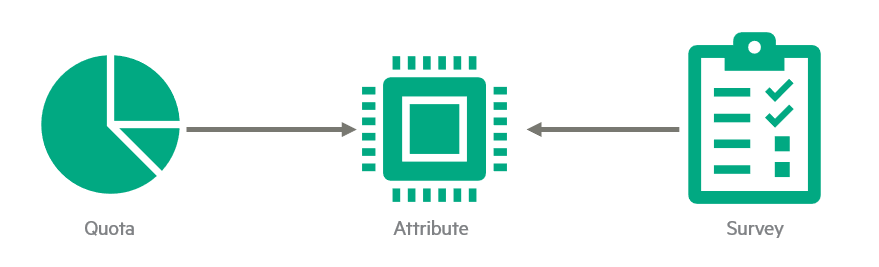

# Attributes

Attributes are variable definition of a **Resource**. Attribute are declared once and can then be used by **Resource Group**.

For example, to manage Kubernetes namespace (as Resource Group) you could create following attributes:

- request.cpu
- request.memory
- limit.cpu
- limit.memory

Attributes can be linked to services. Then can be used by operation survey fields.

## Attributes and quota

Attributes are defined in the resource tracking and then 

- Set as quota on organizations or teams
- Attached to fields of the survey of an operation in the service catalog

So when a user make a request for a new service in the service catalog, some fields from the survey can be limited to the quota defined behind the attribute.

When a resource is [linked to an instance of the service catalog](resource.md#link-a-service-catalog-instance), the quota consumed is automatically updated.
