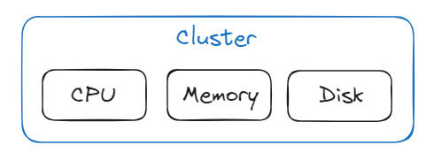
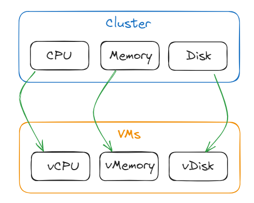
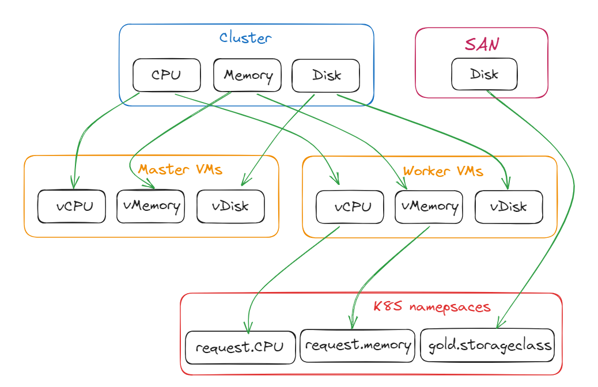

# Resource tracking

Nowadays, IT infrastructures are composed of multiple layers. Physical servers, virtual machines, containers, storage,...
Each layer is consumer or a producer of resources of another layer.
As an IT administrator, we need to monitor resource consumption of a top layers to be sure that we can provide 
services on underlying layers. 

The resource tracking feature allows to monitor reserved resources and highlight available resource in an infrastructure.
It's also a way to set quota to 

!!! note

    This feature is not a real time monitoring. It does not connect to you infrastructure to check the real 
    consumption but help to follow what resources have been reserved to avoid overallocation when accepting new request 
    from the service catalog.

## Concept

### VM tracking example 

To introduce the concept of _attributes_, _resources_ and _resource groups_, lets take the example of a virtualization stack.

A virtualization stack is composed of a group of physical machines, that are added to an hypervisor and create what we usually call a "cluster". The cluster would be, in Squest, a **Resource Group**.

Everytime we add a new physical machine to the cluster, the total amount of resource available increases. A machine is, in this case, a **Resource** of the _Resource Group_.

The amount of resource correspond to the physical server specifications like `CPU`, `memory` or `disk`. Those specs are the **Attributes** of a _Resource_.

Starting from the previous state, we can then create a _Resource Group_ for virtual machines that will **consume** resources from the "cluster" _Resource Group_. 
"VMs" is another _Resource Group_, with their own attributes named `vCPU` and `v_memory` that will consume respectively on attributes from the upper _Resource Group_ "cluster" on `CPU` and `memory`.

If we want to add more VMs that **consume** resources from the "cluster" _Resource Group_, we need to be sure we have enough physical servers (resources) that **produce** into it.  

### Kubernetes tracking example

In this example we want to track the consumption of an orchestrator of container like Kubernetes or Openshift. 
Namespaces (or projects in Openshift world) are a way to divide cluster resources between multiple users by using 
resource quota.

Openshift and Kubernetes frameworks are commonly deployed in a virtual machines. 
So we retrieve layers from previous example with bare metal servers that produce resources in a cluster of our hypervisor.

Orchestrators are usually composed of 2 kind of node: Masters and Workers.
Master VMs are used by the infrastructure itself and workers for user's workloads, aka namespaces.

As namespaces are only executed in "worker" nodes, we need to declare 2 different _resource group_: "Master" and "Worker" VMs.

The aggregation of resources of all workers compose amount of available resources that the `namespaces` 
_resource group_ can theoretically consume.

The complete resource tracking definition would look like the following:

With this definition, we are able to determine there is enough available resources in each layer to handle underlying objects.

Adding a new namespace in the last _resource group_ `K8S namespaces` will generate more consumption.
If this last layer resource group is lacking of resources, adding more worker node in the `Worker VMs` _resource 
group_ will be required, generating consumption on the upper layer `Cluster` and so on...
