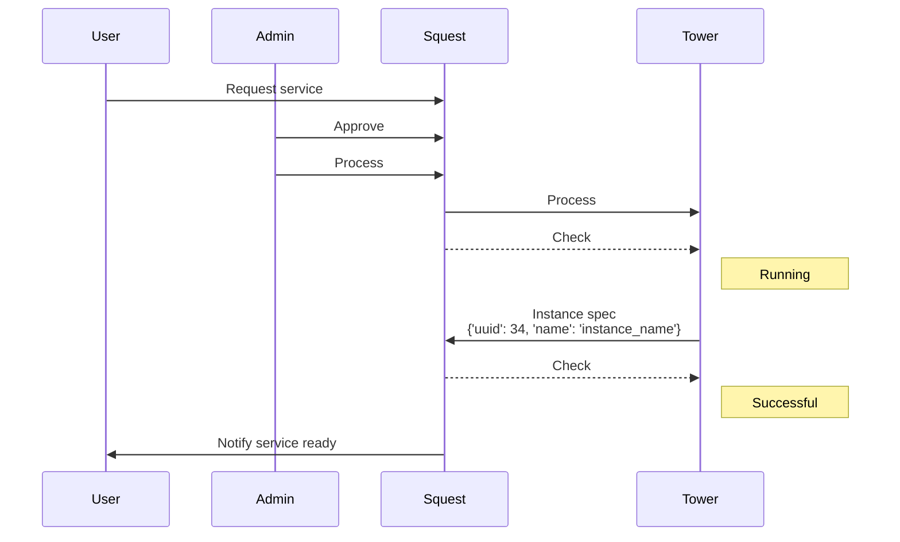
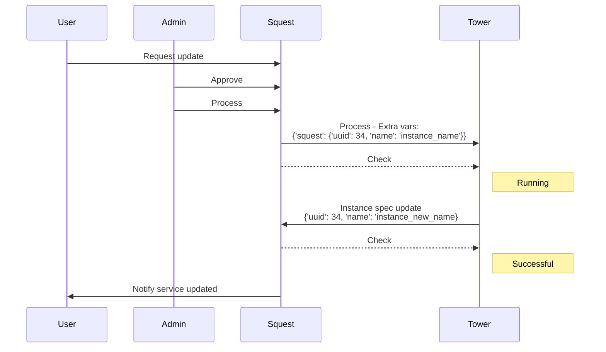

# Lifecycle management

## Populate the service catalog

Once Squest is linked to a Tower/AWX server, "services" can be added into the catalog.

A service is composed of `operations` that are pointers to "job templates" present in Tower/AWX.

A service has at least one operation of type `CREATE` that allows to provision the resource.

A service can have then multiple operation of type `UPDATE` and `DELETE` that allow to manage the lifecycle of instances that have been created via the `CREATE` operation.

>**Note:** Surveys in Squest are actually surveys attached to each job templates in your Tower/AWX. 
Squest can only disable the ones that you don't want to be filled by your end users. 
Those fields, if declared as mandatory on Tower/AWX, will need to be filled anyway by the admin when approving a request.


## Provisioning a service

When a user request for the first time a service, an instance is created automatically and set to "pending" state on Squest.
Once approved by the administrator, the request is sent to Tower to execute the linked job template.

The executed job, aka the Ansible playbook, need to call back the Squest API in order to attach information (spec) to the pending instance.

Squest provisioning workflow:


The playbook will receive a `squest` extra variable that contains information of to the pending instance linked to the request 
in addition to all extra variables which come from the survey of the job template.

Example of extra variables sent by Squest:
```yaml
squest:
  request:
    instance:
      id: 1
      name: test
      service: 1
      spec:
        file_name: foo.conf
      state: PROVISIONING
      spoc: 2
```

Specs related to the created instance are important in order to be sent later to a playbook in charge of updating 
this particular instance.

Sent specs must contain unique IDs that allow to identify precisely the instance. 
(E.g: `uuid` of a VMware VM, `namespace` and `cluster_api_url` for an Openshift project)


### Playbook example

In the example below, we've configured a job template with a survey that ask for a variable named `file_name`.
The playbook will:

- create the resource (the file)
- call Squest api to link spec of the created resource to the instance

```yaml
- name: Create a file
  hosts: localhost
  connection: local
  gather_facts: false
  
  vars:
    squest_token: 48c67f9c2429f2d3a1ee0e47daa00ffeef4fe744
    squest_bearer_token: "Bearer {{ squest_token }}"
    squest_api_url: "http://192.168.58.128:8000/api/"

  tasks:
    - name: Print the job template survey variable
      debug:
        var: file_name

    - name: Print info sent by Squest
      debug:
        var: squest

    - name: Create a file with the given file_name
      ansible.builtin.file:
        path: "/tmp/{{ file_name }}"
        owner: user
        group: user
        mode: '0644'
        state: touch

    - name: Update spec of the instance via the squest API
      uri:
        url: "{{ squest_api_url }}service_catalog/admin/instance/{{ squest['request']['instance']['id'] }}/" # do not forget the last slash
        headers:
          Authorization: "{{ squest_bearer_token }}"
        method: PATCH
        body:
          spec:
            file_name: "{{ file_name }}"
        status_code: 200
        body_format: json
```

## Day 2 operations

Day 2 operations are operations that **update** or **delete** existing resources.

> **Note:** By default, recent version of AWX/Tower drop extra variables that are not declared in the survey. To be able to receive Squest extra vars you need to enable "Prompt on Launch" in the "Variables" section of you job template. This correspond to the flag "ask_variables_on_launch" of the job_template model on the Tower/AWX API.

When a user creates a request for a day 2 operation of a provisioned instance, Squest automatically attach an `extra_vars` named `squest` 
that contains the instance spec sent by the playbook used to provision at first the resource.

The playbook used to update the instance need to use info placed in `squest` variable to retrieve the real resource that need to be updated or deleted.
The update playbook can send a new version of the instance to squest at the end of its process if required.



### Playbook example

Example of extra vars sent by squest:
```yaml
squest:
  request:
    instance:
      id: 1
      name: test-instance
      service: 1
      spec: 
        file_name: foo.conf
      spoc: 2
      state: UPDATING
string_to_place_in_file: "this is a string"
```

In the example below, the update job template survey ask for a `string_to_place_in_file` variable. 
The playbook receive as well all information that help to retrieve the resource to update. In this example the resource is the `file_name`.
```yaml
- name: Update content of a file
  hosts: localhost
  connection: local
  gather_facts: false

  tasks:
    - name: Print the job template survey variable
      debug:
        var: string_to_place_in_file

    - name: Print info sent by Squest
      debug:
        var: squest

    - name: Add content into the file_name given by squest instance spec
      ansible.builtin.lineinfile :
        path: "/tmp/{{ squest['request']['instance']['spec']['file_name'] }}"
        line: "{{ string_to_place_in_file }}"
        create: yes
```
