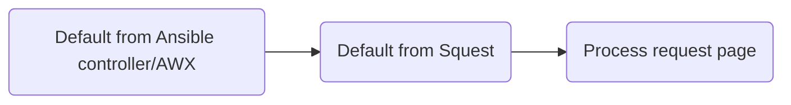
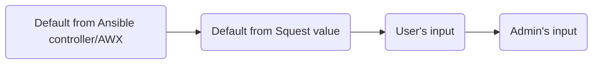

# Operation

## Configuration

| Name                   | Description                                                                                                          |
|------------------------|----------------------------------------------------------------------------------------------------------------------|
| Name                   | Short name of the operation                                                                                          |
| Description            | Small description of the operation                                                                                   |
| Job template           | Executed job template in the backend Ansible controller/AWX server                                                   |
| Operation type         | Type of operation (Create, update, delete). Change the state of he instance after executing the operation            |
| Approval workflow      | Define an optional [approval workflow](#approval)                                                                    |
| Process timeout        | Number of second to wait for a successful return from the executed job template                                      |
| Auto accept            | If set to `True` a submitted request for this operation will be automatically accepted                               |
| Auto process           | If set to `True` an accepted request for this operation will be automatically processed                              |
| Enabled                | If set to `True` the operation can be requested from the UI and API                                                  |
| Is admin operation     | If set to `True` the operation is only visible and can be only requested by administrators                           |
| Extra vars             | Set of extra vars as JSON                                                                                            |
| Default inventory ID   | ID of the Ansible controller/AWX inventory to use by default.  Leave blank to use the default Job Template inventory |
| Default limit          | Comma separated list of inventory host limits                                                                        |
| Default tags           | Comma separated list of tags to use                                                                                  |
| Default skip tags      | Comma separated list of tags to skip                                                                                 |
| Default verbosity      | Verbosity level (integer)                                                                                            |
| Default job type       | Job type (Run or Check)                                                                                              |
| Default diff mode      | Default `False`. This is equivalent to Ansible's --diff mode in the CLI                                              |
| Default credential IDs | Comma separated list of credentials ID                                                                               |

## Job template config

By default, Squest will execute the selected Job Template with the config as set in Ansible controller/AWX.

If a field is configured to "Prompt on launch" in Ansible controller/AWX, the administrator can override it from the "Process" page
of an accepted request:

Overridable fields:

- Inventory (ID)
- Limit (hosts)
- Tags
- Skip tags
- Verbosity
- Job type
- Diff mode (Show changes)
- Credentials (Comma separated list of ID)

The "default" configuration set at operation level allow to automatically pre-fill the "Process" page with values.

Jinja templating can be used in the default value based on the current `{{ request }}` object as context.
Examples can be retrieved in the [dedicated documentation section](../jinja.md). Full `request` object definition can be
retrieved through the [API documentation](../api.md).

Default value precedence:

!!! note

    **Default inventory ID** field is expecting an integer that correspond the the inventory ID in Ansible controller/AWX.

    **Default credential IDs** field is expecting a comma separated list of integer that correspond existings credentials ID in Ansible controller/AWX.

## Approval

By default, _Requests_ can be approved by any administrator when
_Approval Workflow_ is not defined in the _Operation_. After being approved, the _Request_ is in 'ACCEPTED' state and
can be
processed.

### Approval Workflow

An _Approval Workflow_ is composed by one or multiple [_Approval Step_](#approval-step).
_Approval Steps_ of the Workflow must be approved one by one following the order. After accepting the last one, the
request witch to 'ACCEPTED' state and can be processed.

!!! note

      The auto-accept option can not be set in the _Operation_ with an Approval Workflow.

### Approval Step

An _Approval Step_ can only be approved by its _Teams_ members. It is approved when all _Teams_ approved the _Request_
or at
least one depending on the [Type](#type).

!!! note

      Approval Steps are linked to Teams and not users. It means that any member can approved for his Team.

| Name  | Description                                                            |
|-------|------------------------------------------------------------------------|
| Name  | Unique identifier of the _Approval Step_ in the _Approval Workflow_.   |
| Type  | Defined how the _Approval Step_ is Approved. See supported types below |
| Teams | List of Teams that can approve the Approval Step.                      |

**Type**

- **At least one:** At least one team must approve the _Approval Step_ to move to the next one.
- **All of them:** All teams of the _Approval Step_ must approve to move to the next one.

## Survey

The survey of an operation can be edited to change the behavior of the generated form of a request.

!!! note

    Surveys in Squest are actually surveys attached to each job templates in your Ansible controller/AWX.
    Squest can only disable the ones that you don't want to be filled by your end users.
    Those fields, if declared as mandatory on Ansible controller/AWX, will need to be filled anyway by the admin when approving a request.

### End user field

An **end user field**  is a field that will be displayed into the end user survey.
By default, all fields are enabled when creating a new operation.

!!! note

    If the field is set as **required** into the Ansible controller/AWX job template survey config then the administrator
    will have to fill it in any case during the review of the request.

### Default value

When set, the default value is pre-filled into the final form. It takes precedence over the default value set in
Ansible controller/AWX job template survey config.

Default value precedence:

!!! note

    When used with a 'multiple select' or 'multiple select multiple' type of field, the value need to be a valid one from the Ansible controller/AWX survey field options.

**Jinja templating**

Jinja templating can be used in the default value based on the current `{{ instance }}` object as context.
Examples can be retrieved in the [dedicated documentation section](../jinja.md).

Full `instance` object definition can be retrieved through the [API documentation](../api.md).
