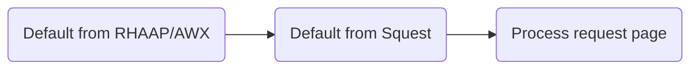
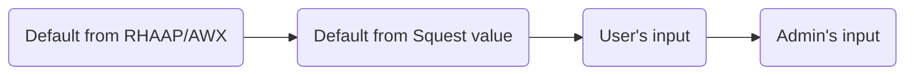
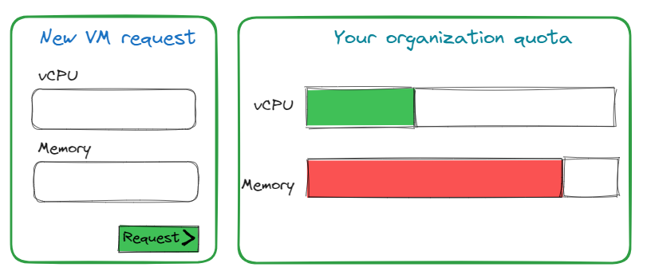

# Operation

An Operation is an action attached to a service that can be requested by the end user.
A service in Squest has at least one operation of type "create" which allows to create an instance of the service.
Operations of type "update" or "delete" can be then added to manage the lifecycle of created instances of the service.

## Configuration

| Name                   | Description                                                                                               |
|------------------------|-----------------------------------------------------------------------------------------------------------|
| Name                   | Short name of the operation                                                                               |
| Description            | Small description of the operation                                                                        |
| Job template           | Executed job template in the backend RHAAP/AWX server                                                     |
| Operation type         | Type of operation (Create, update, delete). Change the state of he instance after executing the operation |
| Process timeout        | Number of second to wait for a successful return from the executed job template                           |
| Auto accept            | If set to `True` a submitted request for this operation will be automatically accepted                    |
| Auto process           | If set to `True` an accepted request for this operation will be automatically processed                   |
| Enabled                | If set to `True` the operation can be requested from the UI and API                                       |
| Admin operation        | If set to `True` the `admin_request_on_instance` permission is required to request this operation         |
| Extra vars             | Set of extra vars as JSON                                                                                 |
| Default inventory ID   | ID of the RHAAP/AWX inventory to use by default.  Leave blank to use the default Job Template inventory   |
| Default limit          | Comma separated list of inventory host limits                                                             |
| Default tags           | Comma separated list of tags to use                                                                       |
| Default skip tags      | Comma separated list of tags to skip                                                                      |
| Default verbosity      | Verbosity level (integer)                                                                                 |
| Default job type       | Job type (Run or Check)                                                                                   |
| Default diff mode      | Default `False`. This is equivalent to Ansible's --diff mode in the CLI                                   |
| Default credential IDs | Comma separated list of credentials ID                                                                    |

## Job template config

By default, Squest will execute the selected Job Template with the config as set in RHAAP/AWX. 

If a field is configured to "Prompt on launch" in RHAAP/AWX, the administrator can override it from the "Process" page of an accepted request:

Overridable fields:

- Inventory (ID)
- Limit (hosts)
- Tags
- Skip tags
- Verbosity
- Job type
- Diff mode (Show changes)
- Credentials (Comma separated list of ID)

The "default" configuration set at operation level allow to automatically pre-fill the "Process" page with values.

Jinja templating can be used in the default value based on the current `{{ request }}` object as context.
Examples can be retrieved in the [dedicated documentation section](../advanced/jinja.md). Full `request` object definition can be retrieved through the [API documentation](../../administration/api.md).

Default value precedence:

!!! note

    **Default inventory ID** field is expecting an integer that correspond the the inventory ID in RHAAP/AWX.

    **Default credential IDs** field is expecting a comma separated list of integer that correspond existings credentials ID in RHAAP/AWX.

## Survey

The survey of an operation can be edited to change the behavior of the generated form of a request.

!!! note

    Surveys in Squest are actually surveys attached to each job templates in your RHAAP/AWX.
    Squest can only disable the ones that you don't want to be filled by your end users.
    Those fields, if declared as mandatory on RHAAP/AWX, will need to be filled anyway by the admin when approving a request.

### Is customer field

A **customer field**  is a field that will be displayed into the end user survey.
By default, all fields are enabled when creating a new operation.

!!! note

    If the field is set as **required** into the RHAAP/AWX job template survey config then the administrator
    will have to fill it in any case during the review of the request.

### Default value

When set, the default value is pre-filled into the final form. It takes precedence over the default value set in RHAAP/AWX job template survey config.

Default value precedence:

!!! note

    When used with a 'multiple select' or 'multiple select multiple' type of field, the value need to be a valid one from the RHAAP/AWX survey field options.

**Jinja templating**

Jinja templating can be used in the default value based on the current `{{ instance }}` and `{{ user }}` objects as context.
Examples can be retrieved in the [dedicated documentation section](../advanced/jinja.md).

Full `instance` and `user `object definition can be retrieved through the [API documentation](../../administration/api.md).

### Validators

Field validators are python modules that can be added as plugin to perform a custom check on a form field.
See related [documentation here](../advanced/validators.md).

### Attribute definition

Each field can be linked to an _Attribute definition_ from the resource tracking. This allows to automatically limit the field value to a quota.
The available quota is shown in the form of the request so the end user know what he can still consume.

