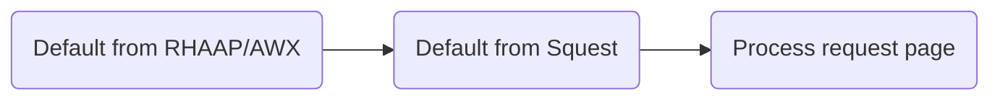

# Operation

An Operation is an action attached to a service that can be requested by the end user.
A service in Squest has at least one operation of type "create" which allows to create an instance of the service.
Operations of type "update" or "delete" can be then added to manage the lifecycle of created instances of the service.


## Configuration

| Name                   | Description                                                                                               |
|------------------------|-----------------------------------------------------------------------------------------------------------|
| Name                   | Short name of the operation                                                                               |
| Description            | Small description of the operation                                                                        |
| Job template           | Executed job template in the backend RHAAP/AWX server                                                     |
| Operation type         | Type of operation (Create, update, delete). Change the state of he instance after executing the operation |
| Process timeout        | Number of second to wait for a successful return from the executed job template                           |
| Auto accept            | If set to `True` a submitted request for this operation will be automatically accepted                    |
| Auto process           | If set to `True` an accepted request for this operation will be automatically processed                   |
| Enabled                | If set to `True` the operation can be requested from the UI and API                                       |
| Admin operation        | If set to `True` the `admin_request_on_instance` permission is required to request this operation         |
| Extra vars             | Set of extra vars as JSON                                                                                 |
| Default inventory ID   | ID of the RHAAP/AWX inventory to use by default.  Leave blank to use the default Job Template inventory   |
| Default limit          | Comma separated list of inventory host limits                                                             |
| Default tags           | Comma separated list of tags to use                                                                       |
| Default skip tags      | Comma separated list of tags to skip                                                                      |
| Default verbosity      | Verbosity level (integer)                                                                                 |
| Default job type       | Job type (Run or Check)                                                                                   |
| Default diff mode      | Default `False`. This is equivalent to Ansible's --diff mode in the CLI                                   |
| Default credential IDs | Comma separated list of credentials ID                                                                    |
| When                   | Ansible 'when' condition to make operation available to some instance spec condition                      |
| Permission             | Set a permission required to view the operation. By default set to "view_operation"                       |

## Job template config

By default, Squest will execute the selected Job Template with the config as set in RHAAP/AWX.

If a field is configured to "Prompt on launch" in RHAAP/AWX, the administrator can override it from the "Process" page of an accepted request:

Overridable fields:

- Inventory (ID)
- Limit (hosts)
- Tags
- Skip tags
- Verbosity
- Job type
- Diff mode (Show changes)
- Credentials (Comma separated list of ID)

The "default" configuration set at operation level allow to automatically pre-fill the "Process" page with values.

Jinja templating can be used in the default value based on the current `{{ request }}` object as context.
Examples can be retrieved in the [dedicated documentation section](../advanced/jinja.md). Full `request` object definition can be retrieved through the [API documentation](../../administration/api.md).

Default value precedence:



!!! note

    **Default inventory ID** field is expecting an integer that correspond the the inventory ID in RHAAP/AWX.

    **Default credential IDs** field is expecting a comma separated list of integer that correspond existings credentials ID in RHAAP/AWX.

## When condition

The when configuration allows to filter day 2 operations following conditions based on the `instance` object state.

For example, to expose an operation based on a user spec of an instance. The `when` condition can be setup like the following:
```
instance.user_spec.location==grenoble
```

With this configuration, only instances with the following user_spec will see the operation from the instance details view:
```json
{
    "location": "grenoble"
}
```

!!! note

    Like for Ansible, double curly braces are not used in 'when' declaration.
