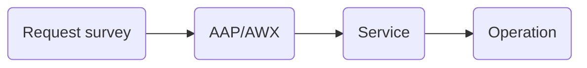

# Service

## Configuration

| Name                 | Description                                             |
|----------------------|---------------------------------------------------------|
| Name                 | Short name of the service                               |
| Description          | Small description of the operation                      |
| Image                | Image used into the catalog                             |
| Billing              | Define the billing behavior when requesting the service |
| Enabled              | If set to `True` the service is visible in the catalog  |
| External support URL | Define an external support  tool URL                    |
| Extra vars           | Set of extra vars as JSON                               |


## Billing group

By default, Squest services are not linked to any billing group.

Administrators can configure how the billing of the service will be predefined.

Through the service form, choices are:

  - Administrator defined billing group
  - User defined billing group:
    - From his billing group
    - From all billing group

**Administrator defined billing group**

Administrators select a fixed billing group (can be none).
Each created instance will be linked to this billing group.

Administrators can also hide the billing from the end users.
The billing group will not be asked neither shown in the end user form when requesting the service.

**User defined billing group**

- **From his billing group:** Administrators let the end user choose from his billing group when he sends an instance request.
- **From all billing group:** Administrators let the end user choose from all available billing group when he requests a service.

## Extra vars

Some extra variables can be declared on some Squest level like `tower_server`, `service` or `operation`.

These extra variables are added automatically when processing a request and so executing a job template.

If an extra variable is set with the same name in different places, the variable will be overridden following a certain order.
Squest will apply the following variable precedence:



## External support URL

Squest has an integrated support management. End user can open a support ticket on available instances.
An external url can be defined as support tool in each service configuration. This allows to configure for example a redirection to services like GitHub issues or Jira.

The external support URL support jinja templating to insert the current instance metadata as query parameters.

E.g:
```
http://my_external_tool.domain.local/?instance_name={{ instance.name }}?instance_id={{ instance.id }}?vm_os={{ instance.spec.vm_os }}
```

Example with [Github issue query parameters](https://docs.github.com/en/enterprise-server@3.1/issues/tracking-your-work-with-issues/creating-an-issue#creating-an-issue-from-a-url-query):
```
https://github.com/HewlettPackard/squest/issues/new?title=Templated+Github+issue&body=Instance%3A+{{ instance.name }}
```

!!! note

    Special characters need to be converted into a format that can be transmitted over the Internet. URLs can only be sent over the Internet using the ASCII character-set.
