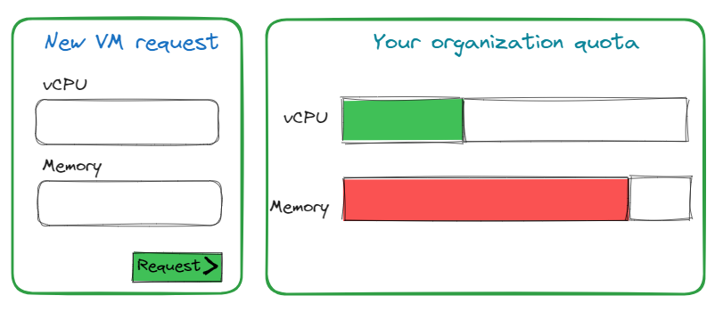

# Survey

The survey of an operation in Squest is actually the one configured in the RHAAP/AWX job templates.

Squest administrator can select which fields will be exposed to the end users when requesting a service or a day 2 operation.

By default, the approval workflow is composed of 2 steps:

- Customer form (fields noted as 'customer field')
- Admin form (All fields of the job template)

If more steps are needed, you can create a dedicated [approval workflow](../administration/approval_workflow.md).

## Is customer field

A **customer field**  is a field that will be displayed into the end user survey.
By default, all fields are enabled when creating a new operation.

Fields that are not **customer fields** can be filled by any users who have the **accept_request** permission.

!!! note

    If the field is set as **required** into the RHAAP/AWX job template survey config then the administrator
    will have to fill it in any case during the review of the request.

## Default value

When set, the default value is pre-filled into the final form. It takes precedence over the default value set in RHAAP/AWX job template survey config.

Default value precedence:

!!! note

    When used with a 'multiple select' or 'multiple select multiple' type of field, the value need to be a valid one from the RHAAP/AWX survey field options.

**Jinja templating**

Jinja templating can be used in the default value based on the current `{{ instance }}` and `{{ user }}` objects as context.
Examples can be retrieved in the [dedicated documentation section](../advanced/jinja.md).

Full `instance` and `user `object definition can be retrieved through the [API documentation](../../administration/api.md).

## Validators

SurveyValidator are python modules that can be added as plugins to perform a custom check on your form.
See related [documentation here](../advanced/survey_validators.md).

## Attribute definition

Each field can be linked to an _Attribute definition_ from the resource tracking. This allows to automatically limit the field value to a [quota](../access.md#quota).
The available quota is shown in the form of the request so the end user know what he can still consume.

